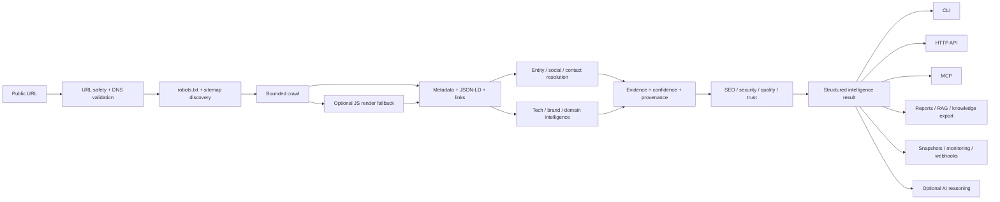

# 🧠 URL Intelligence Agent

<p align="center">
  <strong>URL in. Identity, evidence and intelligence out.</strong>
</p>

<p align="center">
  Evidence-first public web intelligence for developers, AI agents, marketplaces, directories, research, monitoring and automation.
</p>

<p align="center">
  
  
  
  
  
  
</p>
<p align="center">
  <a href="https://aiagentslisting.com/url-intelligence-agent">
    
  </a>
</p>
<p align="center">
  
</p>

<p align="center">
  <a href="#-5-minute-quick-start"></a>
  <a href="docs/MCP.md"></a>
  <a href="docs/DEPLOYMENT.md"></a>
  <a href="docs/API.md"></a>
  <a href="https://hrn.ae/githubsupport"></a>
</p>

---

## 🔥 Already running inside the HORNO ecosystem — now open source

**URL Intelligence Agent** is one of the intelligence components used inside the **HORNO ecosystem** to understand public URLs, normalize entities, enrich profiles and listings, discover public relationships, evaluate web signals and prepare structured information for product workflows.

The complete agent architecture is available here as open source so developers can inspect it, self-host it, extend it and integrate the same evidence-first approach into their own applications and AI systems.

<p align="center">
  <a href="https://horno.net"></a>
  <a href="https://easy.horno.net"></a>
  <a href="https://space.horno.net"></a>
</p>

---

## ⚡ Full Agent or lightweight standalone version?

The two repositories are complementary and can be used independently.

If you need the complete intelligence layer — multi-page crawling, entity resolution, confidence and provenance, monitoring, reports, MCP, HTTP API, domain intelligence, technology detection, security/SEO analysis and optional AI reasoning — use **URL Intelligence Agent**.

If your application only needs fast, deterministic URL enrichment without the complete agent stack, use the lighter standalone project:

### 🔗 URL Metadata & Social Profile Fetcher

**https://github.com/vpicciuolo/url-metadata-social-fetcher**

It is the lightweight standalone option for applications that mainly need to take a public URL and extract reusable metadata such as titles, descriptions, Open Graph data, canonical URLs, images, social links and profile information with safety-focused fetching.

It is especially useful for:

- link previews and URL unfurling
- listing/profile autofill
- directories and marketplaces
- smart links and digital identity pages
- creator/product/project cards
- social-link discovery
- metadata and Open Graph enrichment
- applications that do **not** need a full autonomous intelligence agent

| Choose | URL Intelligence Agent | URL Metadata & Social Profile Fetcher |
| --- | --- | --- |
| Primary goal | Full evidence-first URL/entity intelligence | Fast lightweight URL enrichment |
| Multi-page intelligence | ✅ Deep crawl, sitemaps, important-page discovery | Focused lightweight extraction |
| Entity resolution | ✅ Confidence + evidence + provenance | Basic profile/metadata enrichment |
| SEO / security / trust / tech intelligence | ✅ | Lightweight metadata focus |
| Monitoring / snapshots / diffs | ✅ | Not the primary purpose |
| MCP server | ✅ | Not required |
| HTTP API / CLI agent workflows | ✅ | Library-oriented integration |
| Optional AI reasoning | ✅ | Deterministic-first lightweight use |
| Best for | AI agents, research, automation, intelligence platforms | Previews, directories, autofill, smart links, simple integrations |

<p align="center">
  <a href="https://github.com/vpicciuolo/url-metadata-social-fetcher"></a>
</p>

**Simple rule:** if you only need to understand and enrich a URL, start with the lightweight repository. If you need to investigate, verify, connect, score, monitor and expose that intelligence to applications or AI agents, use this repository.

---

## Navigation

[Quick Start](#-5-minute-quick-start) · [How it works](#-how-the-agent-works) · [Capabilities](#-what-it-can-do) · [CLI](#-cli-command-reference) · [MCP](#-use-it-as-an-mcp-server) · [HTTP API](#-run-it-as-an-http-api) · [Docker](#-deploy-it) · [SDK](#-use-it-as-a-typescript-library) · [Reports](#-reports-and-exports) · [Monitoring](#-monitoring-and-change-detection) · [Configuration](#%EF%B8%8F-configuration) · [Security](#-security-model) · [Support](#-support-open-source-development)

---

# What is URL Intelligence Agent?

A metadata parser can tell you a page title.

A crawler can collect pages.

A language model can summarize text.

**URL Intelligence Agent connects those layers into a single evidence-first workflow.**

Give it a public URL and it can answer:

> **What is this URL? What person, company, product, creator or project does it represent? Which public signals support that conclusion? What else is connected to it? What changed? What can an application or AI agent safely do with the result?**

It combines deterministic collection, structured extraction, entity resolution, confidence scoring, provenance, crawling, infrastructure intelligence, monitoring and optional AI reasoning.

### Core principle

```text
Do not ask an LLM to guess what deterministic public evidence can establish.
```

AI is an enhancement layer. It is **not required** for the main intelligence pipeline.

---

# ⚡ 5-minute quick start

## 1. Clone and install

```bash
git clone https://github.com/vpicciuolo/url-intelligence-agent.git
cd url-intelligence-agent
npm install
npm run build
```

## 2. Investigate a public URL

```bash
node dist/src/cli.js investigate https://example.com
```

Or during development:

```bash
npm run dev -- investigate https://example.com
```

## 3. Open the interactive console

```bash
npm run dev
```

You will get the full action menu with **39 interactive operations**, including investigation, crawling, domain intelligence, social/contact discovery, SEO, security, monitoring, reports, MCP and API modes.

## 4. Install globally if you want `url-agent` everywhere

```bash
npm install -g github:vpicciuolo/url-intelligence-agent
```

Then:

```bash
url-agent investigate https://example.com
url-agent seo https://example.com
url-agent technologies https://example.com
url-agent mcp
```

---

# 🔄 How the agent works



Every major resolved field can carry:

```json
{
  "value": "Example Inc.",
  "confidence": 0.97,
  "method": "jsonld-name+og-site-name+page-title",
  "sources": [
    "https://example.com/",
    "https://example.com/about"
  ]
}
```

That provenance model is one of the central differences between this project and a basic scraper or model-only web summary.

---

# 🧩 What it can do

The 1.0.0 runtime exposes **34 machine-callable core actions** through the action registry. The interactive CLI combines them with reporting, watching, benchmarking, server and plugin operations for **39 menu choices**. Plugins can extend the action surface further.

| Intelligence area | What the agent does |
| --- | --- |
| **Safe URL collection** | HTTP/HTTPS validation, DNS checks, private-network blocking, redirect re-validation, bounded time/bytes |
| **Crawl & map** | robots.txt, sitemaps, sitemap indexes, same-origin crawl, important-page discovery |
| **Entity resolution** | Person, creator, startup, organization, product, service, software, business, event and website inference |
| **Metadata** | title, description, canonical, Open Graph, headings, JSON-LD, images, favicons |
| **Social discovery** | normalized public social/profile links across supported networks |
| **Contact discovery** | public emails, phones, contact pages and public people/team signals |
| **Domain intelligence** | A/AAAA/MX/NS/TXT/CAA, SPF/DMARC hints, TLS certificate/protocol/cipher information |
| **Technology detection** | framework, CMS, ecommerce, analytics, payments, CDN, hosting and tooling fingerprints |
| **Brand intelligence** | name candidates, logo/favicon, social preview images, public handles, tagline/color hints |
| **SEO audit** | metadata, canonical, OG, structured data, sitemap, noindex and duplicate-title signals |
| **Security posture** | visible HTTP security headers, HTTPS/HSTS/CSP/frame/referrer/permissions signals |
| **Quality signals** | language, headings, text volume, timing, status, forms and image counts |
| **Trust signals** | explainable public transparency/trust indicators; not a fraud or legal determination |
| **Entity graph** | evidence-linked nodes and relationships between entity, profiles, contacts, pages and technologies |
| **Competitor intelligence** | public comparison/alternative context with evidence and confidence |
| **API discovery** | OpenAPI, Swagger, GraphQL, `/api`, docs, developer portals and `.well-known` references |
| **Compliance signals** | public privacy, cookie, terms, GDPR/CCPA, accessibility, security/trust references |
| **Commerce intelligence** | visible currencies/prices, pricing pages, ecommerce/subscription/marketplace language |
| **Freshness** | publication, modification and HTTP freshness hints |
| **Link intelligence** | internal/external links, external domains, bounded link health checking |
| **Listing generation** | directory/marketplace/ranking-board ready-to-review profile data |
| **RAG export** | citation-friendly clean documents with checksums and provenance |
| **Knowledge export** | structured facts prepared for downstream knowledge systems |
| **Compare** | compare entity type, socials, contacts, technologies, canonical host, SEO/trust |
| **Batch workers** | bounded concurrent investigations of multiple URLs |
| **Monitoring** | snapshots, diffs, continuous watch and optional webhook delivery |
| **Rendering** | optional Playwright or remote renderer fallback for JavaScript-heavy pages |
| **AI reasoning** | optional OpenAI-compatible evidence-only synthesis |
| **Plugins** | runtime enrichers and custom actions |
| **MCP** | native stdio MCP server exposing the runtime action registry |
| **HTTP API** | authenticated/rate-limited JSON action server |
| **Reports** | Markdown, standalone HTML and JSON output with attribution |

<details>
<summary><strong>Show the complete 39-option interactive menu</strong></summary>

```text
 1. Full URL investigation
 2. Safe URL probe / redirects
 3. Domain + DNS + mail + TLS intelligence
 4. Deep crawl + sitemap mapping
 5. Render JavaScript page / browser fallback
 6. Resolve entity + evidence graph
 7. Find social profiles
 8. Find public contacts + people
 9. Technology fingerprinting
10. Brand intelligence
11. SEO audit
12. Security-header posture audit
13. Quality/accessibility/performance audit
14. Trust/transparency signals
15. Entity relationship graph
16. Competitor/comparison intelligence
17. Structured-data inventory
18. API / OpenAPI / GraphQL discovery
19. Privacy/compliance public signals
20. Team / people extraction
21. Commerce / pricing intelligence
22. Content freshness signals
23. Link graph / external-domain intelligence
24. Broken-link / URL health check
25. Generate marketplace/directory listing
26. RAG-ready document export
27. Knowledge/fact export with provenance
28. Generate Markdown + HTML + JSON reports
29. Compare two URLs
30. Batch enrichment worker
31. Create monitoring snapshot
32. Diff current URL against stored snapshot
33. Continuous scheduled watch + webhook
34. Optional AI evidence reasoning
35. Run reliability benchmark
36. Plugins / extension SDK
37. HTTP API server
38. MCP server
39. About & credits
 0. Exit
```

</details>

---

# 💻 CLI command reference

| Command | Example |
| --- | --- |
| Full investigation | `url-agent investigate https://example.com` |
| Safe probe | `url-agent probe https://example.com` |
| Domain/DNS/TLS | `url-agent domain https://example.com` |
| Deep crawl | `url-agent crawl https://example.com` |
| Render page | `url-agent render https://example.com` |
| Entity | `url-agent entity https://example.com` |
| Social profiles | `url-agent socials https://example.com` |
| Contacts/people | `url-agent contacts https://example.com` |
| Technologies | `url-agent technologies https://example.com` |
| Brand | `url-agent brand https://example.com` |
| SEO | `url-agent seo https://example.com` |
| Security | `url-agent security https://example.com` |
| Quality | `url-agent quality https://example.com` |
| Trust | `url-agent trust https://example.com` |
| Entity graph | `url-agent graph https://example.com` |
| Competitors | `url-agent competitors https://example.com` |
| Structured data | `url-agent structured https://example.com` |
| API discovery | `url-agent apis https://example.com` |
| Compliance signals | `url-agent compliance https://example.com` |
| People/team | `url-agent people https://example.com` |
| Commerce | `url-agent commerce https://example.com` |
| Freshness | `url-agent freshness https://example.com` |
| Link intelligence | `url-agent links https://example.com` |
| Link health | `url-agent check-links https://example.com --limit 100` |
| Generate listing | `url-agent listing https://example.com` |
| RAG export | `url-agent rag https://example.com` |
| Knowledge export | `url-agent knowledge https://example.com` |
| Report | `url-agent report https://example.com --out report` |
| Compare | `url-agent compare https://example.com https://example.org` |
| Batch | `url-agent batch urls.txt --concurrency 4` |
| Snapshot | `url-agent snapshot https://example.com` |
| Diff | `url-agent diff https://example.com --snapshot snapshot.json` |
| Watch | `url-agent watch https://example.com --interval 300000` |
| AI reason | `url-agent reason https://example.com --instruction "Summarize evidence"` |
| Benchmark | `url-agent benchmark` |
| List actions | `url-agent actions` |
| Plugins | `url-agent plugins` |
| HTTP API | `url-agent serve --host 127.0.0.1 --port 8787` |
| MCP | `url-agent mcp` |
| Credits | `url-agent about` |

Machine-oriented output:

```bash
url-agent investigate https://example.com --raw > result.json
```

Full usage reference: **[docs/USAGE.md](docs/USAGE.md)**

---

# 🤖 Use it as an MCP server

URL Intelligence Agent includes a native **stdio MCP server**.

## Start MCP

From source:

```bash
npm install
npm run build
npm run mcp
```

Or after global installation:

```bash
url-agent mcp
```

## Generic MCP client config

```json
{
  "mcpServers": {
    "url-intelligence-agent": {
      "command": "url-agent",
      "args": ["mcp"],
      "env": {
        "URL_AGENT_MAX_PAGES": "30",
        "URL_AGENT_MAX_DEPTH": "3",
        "URL_AGENT_OBEY_ROBOTS": "true"
      }
    }
  }
}
```

If the MCP client cannot resolve your shell PATH, use an absolute Node/file path:

```json
{
  "mcpServers": {
    "url-intelligence-agent": {
      "command": "node",
      "args": [
        "/absolute/path/url-intelligence-agent/dist/src/cli.js",
        "mcp"
      ]
    }
  }
}
```

The server supports:

- MCP initialization
- ping
- tool listing
- tool calls
- resource listing/read
- `horno://about` project/ecosystem resource
- structured tool results with attribution

The MCP tool registry is generated from the same core action registry used by the API.

**Complete setup, tool list, JSON-RPC examples and troubleshooting:**  
👉 **[docs/MCP.md](docs/MCP.md)**

---

# 🌐 Run it as an HTTP API

Start locally:

```bash
url-agent serve --host 127.0.0.1 --port 8787
```

Production authentication:

```env
URL_AGENT_API_TOKEN=replace-with-a-long-random-token
URL_AGENT_API_RATE_LIMIT=60
```

Health:

```bash
curl http://127.0.0.1:8787/health
```

Investigate:

```bash
curl \
  -H "Authorization: Bearer YOUR_TOKEN" \
  -G http://127.0.0.1:8787/investigate \
  --data-urlencode "url=https://example.com"
```

Call any registered action:

```bash
curl \
  -X POST \
  -H "Content-Type: application/json" \
  -H "Authorization: Bearer YOUR_TOKEN" \
  http://127.0.0.1:8787/action/audit_seo \
  -d '{"url":"https://example.com"}'
```

Endpoints:

```text
GET  /health
GET  /actions
GET  /investigate?url=...
POST /investigate
GET  /action/:name
POST /action/:name
```

**Complete API reference:**  
👉 **[docs/API.md](docs/API.md)**

---

# 🚀 Deploy it

## Docker CLI

```bash
docker build -t url-intelligence-agent:1.0.0 .

docker run --rm \
  url-intelligence-agent:1.0.0 \
  investigate https://example.com
```

## Docker API

```bash
docker volume create url_agent_data

docker run -d \
  --name url-intelligence-agent \
  --restart unless-stopped \
  --env-file .env \
  -p 8787:8787 \
  -v url_agent_data:/app/.url-agent \
  url-intelligence-agent:1.0.0 \
  serve --host 0.0.0.0 --port 8787
```

## Docker Compose

A `docker-compose.yml` is included.

```bash
cp .env.example .env
docker compose up -d --build
```

Optional Redis service:

```bash
docker compose --profile redis up -d --build
```

Optional PostgreSQL service:

```bash
docker compose --profile postgres up -d --build
```

The deployment guide also includes a Linux **systemd** service example, **Nginx reverse proxy**, production authentication, data persistence, renderer setup and deployment verification checklist.

👉 **[docs/DEPLOYMENT.md](docs/DEPLOYMENT.md)**

---

# 📦 Use it as a TypeScript library

The package exports the core runtime through `src/index.ts`.

```ts
import { investigate, runAction } from "url-intelligence-agent";

const intelligence = await investigate("https://example.com");

console.log(intelligence.entity.name.value);
console.log(intelligence.entity.name.confidence);
console.log(intelligence.entity.name.sources);

const tech = await runAction("detect_technologies", {
  url: "https://example.com"
});

console.log(tech);
```

Install as a GitHub dependency:

```bash
npm install github:vpicciuolo/url-intelligence-agent
```

or:

```json
{
  "dependencies": {
    "url-intelligence-agent": "github:vpicciuolo/url-intelligence-agent"
  }
}
```

---

# 📄 Reports and exports

Generate all standard report formats:

```bash
url-agent report https://example.com --out company-intelligence
```

Output:

```text
company-intelligence.md
company-intelligence.html
company-intelligence.json
```

Reports include project attribution and structured evidence from the investigation.

Other export workflows:

```bash
url-agent rag https://example.com
url-agent knowledge https://example.com
url-agent listing https://example.com
```

RAG output is designed around clean, citation-friendly documents and content checksums. Knowledge output is designed around provenance-aware structured facts.

---

# 👁️ Monitoring and change detection

Create a snapshot:

```bash
url-agent snapshot https://example.com
```

Compare later:

```bash
url-agent diff https://example.com --snapshot snapshot.json
```

Run continuously:

```bash
url-agent watch https://example.com --interval 300000
```

Configure webhooks:

```env
URL_AGENT_WEBHOOK_URL=https://your-app.example/hooks/url-intelligence
URL_AGENT_WEBHOOK_SECRET=replace-with-a-secret
```

Monitoring can surface meaningful changes between normalized intelligence snapshots instead of forcing downstream systems to compare raw HTML.

---

# 🖥️ JavaScript rendering

Static HTTP collection is the default.

For JavaScript-heavy pages, install Playwright:

```bash
npm install playwright
npx playwright install chromium
```

Enable fallback rendering:

```env
URL_AGENT_RENDER_MODE=auto
URL_AGENT_RENDER_TIMEOUT_MS=30000
```

Or use a compatible remote renderer:

```env
URL_AGENT_RENDER_MODE=auto
URL_AGENT_RENDER_ENDPOINT=https://renderer.example.com/render
URL_AGENT_RENDER_API_KEY=your-key
```

Direct render action:

```bash
url-agent render https://example.com
```

Keep rendering disabled when you do not need it; browser automation is significantly heavier than deterministic HTTP collection.

---

# 🧠 Optional AI reasoning

The main agent does **not** require an AI API key.

Configure an OpenAI-compatible endpoint only when reasoning is needed:

```env
AI_BASE_URL=https://api.openai.com/v1
AI_API_KEY=
AI_MODEL=gpt-5-mini
AI_MAX_TOKENS=3000
AI_TEMPERATURE=0.1
AI_TIMEOUT_MS=30000
URL_AGENT_AI_AUTO=false
```

Explicit reasoning:

```bash
url-agent reason https://example.com \
  --instruction "Summarize the entity and uncertainty using only supplied evidence and source URLs."
```

The reasoning layer is instructed not to invent unsupported facts.

---

# ⚙️ Configuration

Start from:

```bash
cp .env.example .env
```

<details>
<summary><strong>Show the main environment variables</strong></summary>

| Variable | Default/example | Purpose |
| --- | --- | --- |
| `URL_AGENT_TIMEOUT_MS` | `10000` | Request timeout |
| `URL_AGENT_MAX_BYTES` | `3000000` | Maximum response bytes |
| `URL_AGENT_MAX_REDIRECTS` | `6` | Redirect bound |
| `URL_AGENT_MAX_PAGES` | `30` | Crawl page bound |
| `URL_AGENT_MAX_DEPTH` | `3` | Crawl depth bound |
| `URL_AGENT_CONCURRENCY` | `4` | Crawl concurrency |
| `URL_AGENT_SAME_ORIGIN` | `true` | Keep crawl same-origin |
| `URL_AGENT_OBEY_ROBOTS` | `true` | Respect robots policy by default |
| `URL_AGENT_ALLOW_PATTERNS` | empty | Optional URL allow patterns |
| `URL_AGENT_DENY_PATTERNS` | safety defaults | URL deny patterns |
| `URL_AGENT_CACHE` | `memory` | Cache adapter selection |
| `URL_AGENT_CACHE_TTL_MS` | `300000` | Cache TTL |
| `URL_AGENT_CACHE_DIR` | `.url-agent/cache` | Local cache directory |
| `URL_AGENT_DATA_DIR` | `.url-agent/data` | Local persistence directory |
| `URL_AGENT_WORKER_CONCURRENCY` | `4` | Batch worker concurrency |
| `URL_AGENT_RENDER_MODE` | `off` | Render/browser mode |
| `URL_AGENT_RENDER_ENDPOINT` | empty | Remote renderer URL |
| `URL_AGENT_RENDER_API_KEY` | empty | Remote renderer auth |
| `URL_AGENT_API_TOKEN` | empty | HTTP API bearer token |
| `URL_AGENT_API_RATE_LIMIT` | `60` | Requests/client/minute |
| `URL_AGENT_CORS_ORIGIN` | empty | Optional API CORS origin |
| `URL_AGENT_WEBHOOK_URL` | empty | Monitoring webhook |
| `URL_AGENT_WEBHOOK_SECRET` | empty | Webhook signing/auth secret |
| `REDIS_URL` | empty | Optional Redis connection |
| `VALKEY_URL` | empty | Optional Valkey connection |
| `DATABASE_URL` | empty | Optional PostgreSQL connection |
| `AI_BASE_URL` | OpenAI-compatible | Optional model endpoint |
| `AI_API_KEY` | empty | Optional model API key |
| `AI_MODEL` | `gpt-5-mini` | Optional model name |
| `URL_AGENT_AI_AUTO` | `false` | Automatic AI reasoning toggle |

</details>

The default settings intentionally bound network and crawl behavior. Increase them only when your workload requires it.

---

# 🛡️ Security model

Every submitted URL is treated as untrusted input.

The network layer includes protections such as:

- HTTP/HTTPS-only policy
- embedded credential rejection
- DNS resolution before collection
- localhost blocking
- private/reserved IPv4 blocking
- loopback/ULA/link-local IPv6 blocking
- redirect destination re-validation
- bounded redirects
- bounded response bytes
- timeouts
- explicit User-Agent

The crawler is designed for **public web intelligence**. It does not intentionally bypass authentication, CAPTCHAs or access controls.

Security/trust scores are public signal summaries — **not penetration tests, legal opinions, fraud determinations or guarantees of security**.

See **[SECURITY.md](SECURITY.md)**.

---

# 🏗️ Architecture

The codebase is intentionally modular:

```text
src/
├── agent.ts        orchestration + action registry
├── net.ts          URL safety / fetching / probing
├── crawler.ts      robots / sitemap / bounded crawling
├── extract.ts      deterministic page extraction
├── render.ts       Playwright / remote render adapters
├── domain.ts       DNS / mail / TLS intelligence
├── analyzers.ts    SEO / security / quality / trust / tech / brand
├── extensions.ts   API / commerce / people / links / knowledge
├── monitor.ts      snapshots / diff / webhook
├── watch.ts        continuous monitoring
├── adapters.ts     cache / persistence / worker adapters
├── ai.ts           optional OpenAI-compatible reasoning
├── plugins.ts      plugin SDK/runtime
├── report.ts       terminal / Markdown / HTML reports
├── server.ts       HTTP API
├── mcp.ts          MCP stdio server
├── benchmark.ts    reliability benchmark runner
└── cli.ts          interactive + command-line experience
```

More detail: **[docs/ARCHITECTURE.md](docs/ARCHITECTURE.md)**

---

# 📚 Documentation

| Guide | Use it when... |
| --- | --- |
| **[Complete Usage Guide](docs/USAGE.md)** | You want every main command, recipe and integration example |
| **[MCP Guide](docs/MCP.md)** | You want to connect the agent to an MCP-compatible AI client |
| **[Deployment Guide](docs/DEPLOYMENT.md)** | You want Docker, Compose, systemd, Nginx or production API deployment |
| **[HTTP API Guide](docs/API.md)** | You want endpoint, auth, curl, JS and Python examples |
| **[Action Reference](docs/ACTIONS.md)** | You want the runtime action catalog |
| **[Architecture](docs/ARCHITECTURE.md)** | You want to understand internal modules and design |
| **[Security](SECURITY.md)** | You want the public-URL/network safety model |
| **[Contributing](CONTRIBUTING.md)** | You want to improve the project |

---

# 🎯 Where this is useful

URL Intelligence Agent is designed for applications such as:

- AI assistants and agent toolchains
- MCP-based research agents
- startup/product directories
- marketplaces
- ranking and attention boards
- creator/influencer platforms
- profile/listing autofill
- CRM/lead enrichment
- public company/project research
- competitive intelligence
- website monitoring
- SEO tooling
- brand intelligence
- digital identity tools
- RAG ingestion
- knowledge pipelines
- public trust/transparency analysis
- broken-link and web quality workflows

The listing-generation and URL enrichment workflows are especially useful when a user pastes a URL and your product needs to turn it into an editable, evidence-backed profile instead of asking the user to fill every field manually.

---

# 🧪 Tests and benchmark

Typecheck:

```bash
npm run typecheck
```

Tests:

```bash
npm test
```

Benchmark:

```bash
npm run benchmark
```

The repository includes a benchmark fixture under `benchmarks/urls.json` for repeatable reliability testing.

---

# 🤝 Contributing

Contributions are welcome, particularly around:

- deterministic extraction
- entity resolution
- new evidence signals
- technology fingerprints
- MCP interoperability
- crawler correctness
- security hardening
- plugin actions
- report UX
- benchmark coverage

Please read **[CONTRIBUTING.md](CONTRIBUTING.md)** before submitting substantial changes.

---

# 💜 Support open-source development

If URL Intelligence Agent saves you engineering time, becomes part of your product, or you simply want to support more open-source tools from this ecosystem, you can support the work here:

<p align="center">
  <a href="https://hrn.ae/githubsupport">
    
  </a>
</p>

**Support page:** https://hrn.ae/githubsupport

GitHub README files cannot safely execute Stripe JavaScript widgets, so the button links directly to the dedicated **Stripe-enabled support page**.

---

# Credits

**Created by Vincenzo Picciuolo**  
Founder & Lead Engineer — **HRN Innovation Technologies Ltd**

Built as part of the technology work behind the **HORNO ecosystem** and released openly for developers and builders.

- HORNO Network: https://horno.net
- Easy HORNO: https://easy.horno.net
- HORNO Space: https://space.horno.net
- URL Metadata & Social Profile Fetcher: https://github.com/vpicciuolo/url-metadata-social-fetcher
- X: https://x.com/vpicciuolo
- X: https://x.com/hornonetwork
- X: https://x.com/BeHotNow2026

If you use the project, **⭐ star the repository**, open an issue with feedback, or show us what you build with it.

---

# License

MIT © 2026 HRN Innovation Technologies Ltd — Vincenzo Picciuolo.
