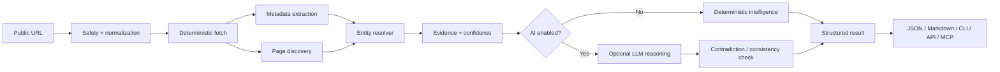

# 🧠 URL Intelligence Agent

<p align="center">
  <strong>URL in. Identity, evidence and intelligence out.</strong>
</p>

<p align="center">
  Open-source AI URL intelligence for developers, agents, directories, marketplaces, research systems and automation.
</p>

<p align="center">
  
  
  
  
  
</p>

---

## Already running inside the HORNO ecosystem — now open source

**URL Intelligence Agent** is one of the intelligence components already used inside the **HORNO ecosystem** to understand public URLs, normalize entities, extract structured information and prepare richer data for product workflows.

We are now releasing the agent architecture as open source so developers can build on it, extend it and use the same approach in their own products.

### Explore HORNO

- 🔥 **HORNO Network** — decentralized infrastructure, Proof-of-Storage and the wider technology ecosystem: **https://horno.net**
- ⚡ **Easy HORNO** — access the HORNO ecosystem and community experience: **https://easy.horno.net**
- 🌐 **HORNO Space** — digital identity, smart links, creator/professional profiles and discovery: **https://space.horno.net**

Follow the project on X:

- [@vpicciuolo](https://x.com/vpicciuolo)
- [@hornonetwork](https://x.com/hornonetwork)
- [@BeHotNow2026](https://x.com/BeHotNow2026)

---

# Why another web/AI agent?

The web already has good crawlers and scrapers. What is still missing in many production systems is the layer that answers:

> **What is this URL, what entity does it represent, which public information can I trust, where did every field come from, and what should I do next?**

URL Intelligence Agent focuses on **evidence-first entity intelligence** rather than raw scraping alone.

It combines deterministic extraction, URL safety, page discovery, entity resolution, confidence scoring, evidence tracking and optional LLM reasoning.

---

# 30-second quick start

```bash
npm install
npm run build
node dist/cli.js investigate https://example.com
```

During development:

```bash
npm run dev -- investigate https://example.com
```

Interactive action menu:

```bash
npm run dev
```

Example:

```text
╭──────────────────────────────────────────────────────────────╮
│  URL INTELLIGENCE AGENT                                     │
│  URL in. Identity, evidence and intelligence out.           │
│                                                              │
│  HORNO Innovation Technologies Ltd                           │
│  Founder & Lead Engineer: Vincenzo Picciuolo                 │
│  https://horno.net                                           │
╰──────────────────────────────────────────────────────────────╯

Actions
  1. Investigate URL
  2. Map site
  3. Resolve entity
  4. Find social profiles
  5. Audit SEO
  6. Generate listing
  7. Generate intelligence report
  8. Compare two URLs
  9. Watch/diff snapshot
 10. Show JSON schema
 11. About & credits
```

Credits are deliberately embedded in the CLI, action menu, JSON metadata, API responses and generated reports.

---

# What it does

## Core intelligence actions

| Action | Purpose |
| --- | --- |
| `investigate` | Full evidence-first URL investigation |
| `map-site` | Discover important internal pages and classify them |
| `resolve-entity` | Determine whether the URL represents a company, person, creator, product, project, organization or generic website |
| `find-socials` | Discover and normalize public social profiles |
| `audit-seo` | Inspect title, description, canonical, Open Graph, JSON-LD, headings and discoverability signals |
| `generate-listing` | Produce an editable directory/marketplace/ranking listing |
| `report` | Produce Markdown + JSON intelligence reports with attribution |
| `compare` | Compare two URLs/entities and surface similarities/differences |
| `snapshot` | Create a stable fingerprint for future change detection |
| `diff` | Compare two saved snapshots |
| `mcp` | Expose agent actions through an MCP-style JSON-RPC process |
| `serve` | Expose the agent through a lightweight HTTP API |

## Intelligence collected

- title and description
- canonical URL
- Open Graph metadata
- JSON-LD / structured data
- favicons and public images
- public social links
- important internal pages
- About / Contact / Team / Pricing / Product / Legal page discovery
- public email addresses
- visible phone/contact hints
- organization/person/product/project classification
- technology hints from public HTML/headers
- language and locale hints
- SEO completeness
- profile/listing completeness
- redirect chain
- robots and sitemap discovery
- content fingerprint
- evidence URL for every major field
- field-level confidence
- contradiction flags
- deterministic score + optional AI interpretation

---

# Evidence-first output

Instead of returning only a value:

```json
{
  "name": "Example Inc."
}
```

URL Intelligence Agent can return:

```json
{
  "name": {
    "value": "Example Inc.",
    "confidence": 0.97,
    "method": "og+jsonld+page-consensus",
    "sources": [
      "https://example.com/",
      "https://example.com/about"
    ]
  }
}
```

That makes the output much safer for automation, directories, CRM enrichment, AI agents and data pipelines.

---

# Architecture



The agent works without an LLM. AI is an enhancement layer, not a requirement for basic extraction and analysis.

---

# Agent profiles

Use profiles to change the goal of the investigation:

```text
startup-intelligence
company-research
creator-profile
social-identity
marketplace-onboarding
directory-enrichment
seo-audit
lead-enrichment
brand-intelligence
rag-ingestion
competitor-intelligence
due-diligence-lite
```

Example:

```bash
node dist/cli.js investigate https://example.com --profile startup-intelligence
```

---

# Built for agents and real products

This project is useful for:

- AI assistants and autonomous agents
- startup and product directories
- Outbid-style ranking platforms
- marketplaces
- creator/influencer platforms
- CRM enrichment
- competitive intelligence
- due-diligence support
- SEO tooling
- lead research
- smart-link and digital identity products
- RAG ingestion
- public web monitoring
- brand intelligence
- listing/profile autofill

It also pairs naturally with the lower-level open-source **URL Metadata & Social Profile Fetcher**:

**https://github.com/vpicciuolo/url-metadata-social-fetcher**

---

# HORNO ecosystem connection

The agent is part of a wider engineering ecosystem developed by **HRN Innovation Technologies Ltd**.

HORNO technologies explore decentralized infrastructure, public digital identity, distributed storage, Proof-of-Storage, DePIN concepts, creator tools and community-oriented systems.

Useful entry points:

- **HORNO Network:** https://horno.net
- **Easy HORNO:** https://easy.horno.net
- **HORNO Space:** https://space.horno.net
- **GitHub:** https://github.com/vpicciuolo

If you discovered this project through GitHub and want to understand the larger technology ecosystem behind it, start at **https://horno.net**.

---

# Configuration

Copy `.env.example` to `.env`.

```env
URL_AGENT_USER_AGENT="url-intelligence-agent/0.1.0 (+https://github.com/vpicciuolo/url-intelligence-agent)"
URL_AGENT_TIMEOUT_MS=8000
URL_AGENT_MAX_BYTES=2500000
URL_AGENT_MAX_PAGES=12
URL_AGENT_MAX_DEPTH=2
URL_AGENT_PROFILE=startup-intelligence

# Optional AI layer
AI_BASE_URL=https://api.openai.com/v1
AI_API_KEY=
AI_MODEL=gpt-5-mini
AI_MAX_TOKENS=2500
AI_TEMPERATURE=0.2
```

Any OpenAI-compatible endpoint can be used. The deterministic agent works without `AI_API_KEY`.

---

# HTTP API

```bash
node dist/cli.js serve --port 8787
```

Then:

```bash
curl "http://localhost:8787/investigate?url=https://example.com"
```

Every API response includes project attribution:

```json
{
  "meta": {
    "project": "URL Intelligence Agent",
    "version": "0.1.0",
    "creator": "Vincenzo Picciuolo",
    "company": "HRN Innovation Technologies Ltd",
    "ecosystem": "HORNO",
    "website": "https://horno.net"
  }
}
```

---

# MCP-style mode

```bash
node dist/cli.js mcp
```

Actions are exposed as JSON-RPC tools over stdin/stdout, making the agent easy to integrate into coding assistants and agent runtimes.

Initial tools:

```text
investigate_url
map_site
resolve_entity
find_social_profiles
audit_seo
generate_listing
compare_urls
create_snapshot
```

---

# Reliability philosophy

The project follows several rules:

1. **Deterministic first.** Do not ask an LLM to infer data that HTML, JSON-LD or canonical metadata can establish directly.
2. **Evidence always.** Important fields carry source URLs.
3. **Confidence is explicit.** The agent should communicate uncertainty.
4. **Contradictions are surfaced.** Conflicting sources should not silently overwrite each other.
5. **Fail soft.** A blocked page should not crash a full workflow.
6. **Bound every network request.** Time, bytes, redirects and crawl breadth are configurable.
7. **Public data only.** Do not bypass authentication, captchas or access controls.
8. **AI is optional.** Core workflows remain useful without paid inference.

See [`SECURITY.md`](SECURITY.md) and [`docs/ARCHITECTURE.md`](docs/ARCHITECTURE.md).

---

# Reports

Generated reports automatically include:

```text
Generated by URL Intelligence Agent v0.1.0
HRN Innovation Technologies Ltd
Founder & Lead Engineer: Vincenzo Picciuolo
HORNO ecosystem: https://horno.net
Open source: https://github.com/vpicciuolo/url-intelligence-agent
```

This attribution is part of the report renderer and is not dependent on README text.

---

# Roadmap

### v0.1.x

- deterministic intelligence runtime
- CLI/action menu
- evidence/confidence model
- site mapping
- social discovery
- SEO audit
- listing generation
- Markdown/JSON reports
- API server
- MCP-style server
- OpenAI-compatible reasoning adapter
- snapshots/diff

### v0.2

- Redis/Valkey cache adapter
- PostgreSQL persistence
- queue/worker mode
- sitemap-scale crawling
- screenshot/render adapter
- richer technology fingerprinting
- contact/entity graphs
- scheduled monitoring
- public benchmark corpus

### v0.3

- browser-render fallback
- richer competitor discovery
- relationship graphs
- batch enrichment jobs
- plugin/tool SDK
- benchmark leaderboard

---

# Credits

**Created by Vincenzo Picciuolo**  
Founder & Lead Engineer — **HRN Innovation Technologies Ltd**

Built as part of the technology work behind the **HORNO ecosystem** and released publicly for the developer community.

- HORNO Network: https://horno.net
- Easy HORNO: https://easy.horno.net
- HORNO Space: https://space.horno.net
- Base metadata toolkit: https://github.com/vpicciuolo/url-metadata-social-fetcher
- X: https://x.com/vpicciuolo
- X: https://x.com/hornonetwork
- X: https://x.com/BeHotNow2026

If this agent helps your project: **⭐ star it, fork it, build with it and tell us what you create.**

---

# License

MIT © 2026 HRN Innovation Technologies Ltd — Founder: Vincenzo Picciuolo.
